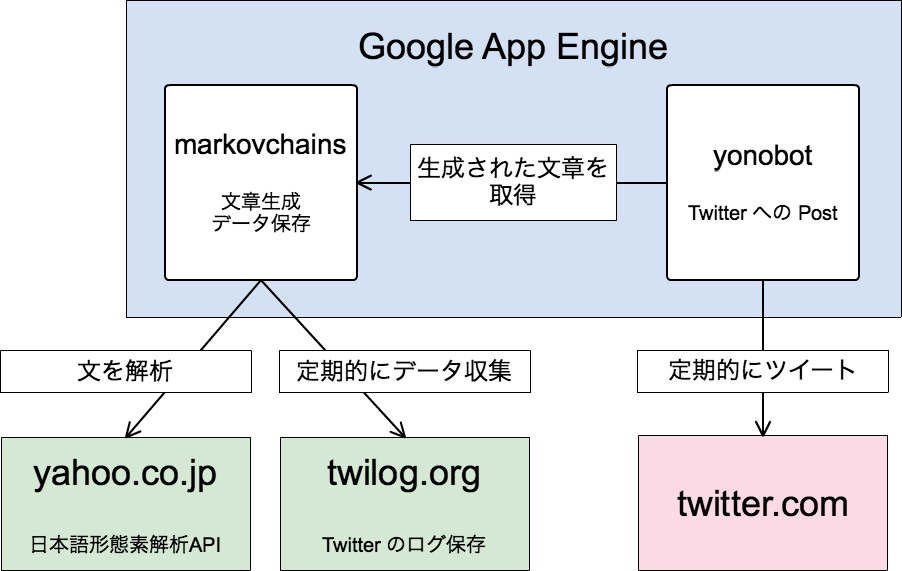
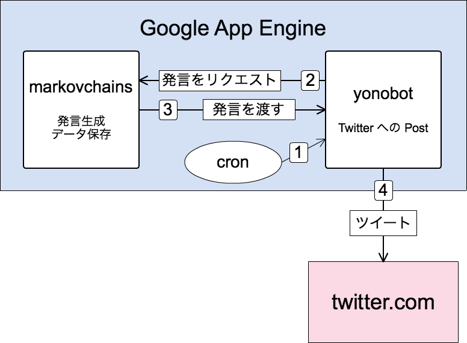

!SLIDE
# よのぼっと勉強会

!SLIDE
# 今回の概要

* よのぼっとについて
* よのぼっとのシステム構成について
* 処理の流れ
* ファイル構成
* ソースコード

!SLIDE
# よのぼっとの概要

* ついったーぼっとです
* ある特定ユーザの発言を基にした発言をします
* 定期的に発言します
* リプライが来たらそれに返します

!SLIDE center
# 構成

  

!SLIDE
# どうしてこんな構成にしたのか

* GAE
* 二つのアプリ

!SLIDE
# GAE を使った理由

* PaaS を一度使ってみたかった
  * PaaS: Platform as a Service
  * 当時は選択肢があまりなかった
* 自宅サーバで運用がつらかった
  * 実は一時期自宅サーバで動かしてました
  * ルータの電源をいつの間にか切られたりしてた

!SLIDE
# GAE のアプリを分けた理由

* 当初は文章生成APIを使い回す予定だった
* 文章生成の負荷が高く、一緒にすると GAE の制限にかかりそうだった
* 実際はよのぼっとクローンでやった通り、ひとつでも十分だった

!SLIDE smbullets
# よのぼっとの基本的な考え方

* よのぼっとは Web アプリケーションで構成されている
  * アクセスが来て初めて動き出す
* yonobot は Twitter へのアクセス担当
  * 比較的シンプル
* markovchains は発言生成担当
  * 重い処理が多い
  * GAE 特有の処理が多い

!SLIDE center
# つぶやくときの処理の流れ

  

!SLIDE code smaller
# ファイル構成(yonobot)
    .
    ├── app.yaml           <- [GAE]アプリケーション設定ファイル
    ├── config.ini         <- yonobotの設定ファイル
    ├── config.ini.sample  <- yonobotの設定ファイルサンプル
    ├── cron.yaml          <- [GAE]cronの設定ファイル
    ├── index.yaml         <- [GAE]データストアのインデックス設定ファイル
    ├── main.py            <- yonobot本体のソースコード
    ├── twilog             <- twilogライブラリ（自作）
    │   ├── __init__.py
    │   └── twilog.py
    └── twoauth            <- twoauthライブラリ
        ├── __init__.py
        ├── api.py
        ├── common.py
        ├── oauth.py
        ├── status.py
        ├── twitterxml.py
        ├── url_method.py
        └── user.py

!SLIDE code smaller
# ファイル構成(markovchains)  
    .
    ├── app.yaml           <- [GAE]アプリケーション設定ファイル
    ├── cron.yaml          <- [GAE]cronの設定ファイル
    ├── index.yaml         <- [GAE]データストアのインデックス設定ファイル
    ├── lib                <- ライブラリ群
    │   ├── database.py
    │   ├── extractword.py
    │   ├── markovchains.py
    │   ├── site.pth
    │   ├── util.py
    │   ├── wakati.py
    │   └── yahoowakati.py
    └── main.py            <- markovchains本体のソースコード

